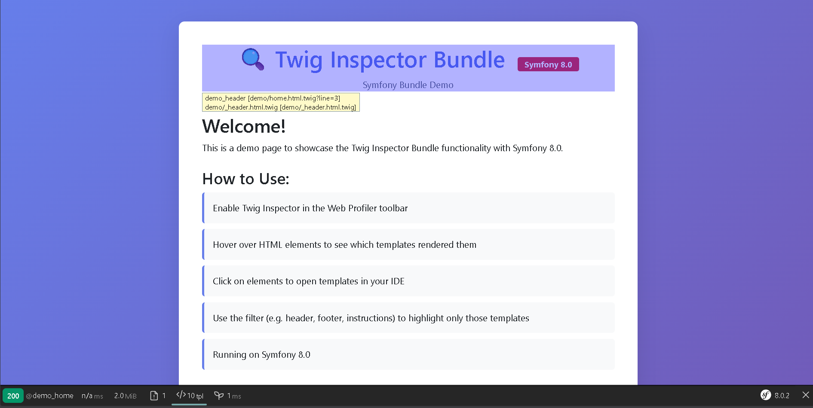
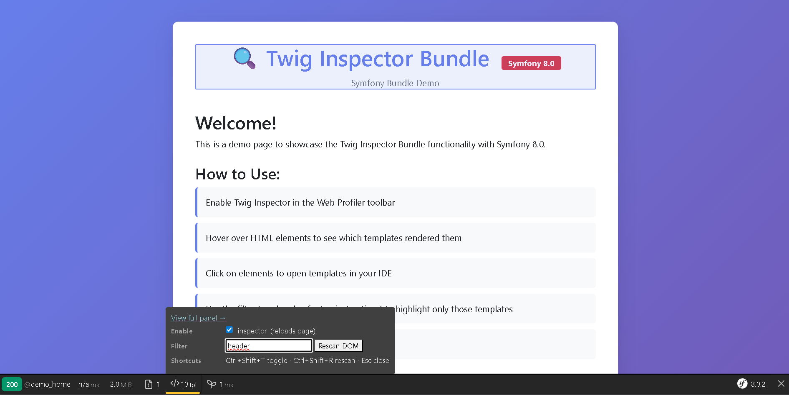
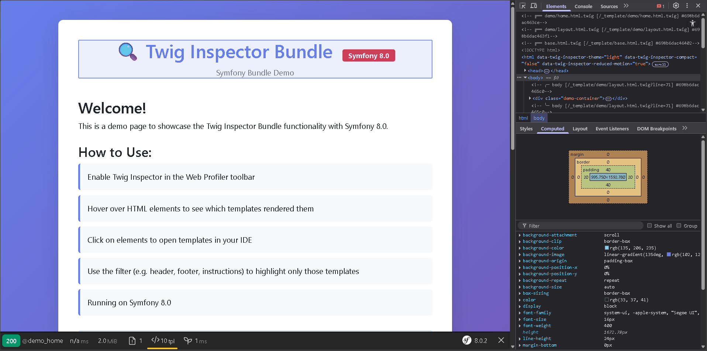

# Twig Inspector Bundle

[](https://github.com/nowo-tech/TwigInspectorBundle/actions/workflows/ci.yml) [](https://packagist.org/packages/nowo-tech/twig-inspector-bundle) [](https://packagist.org/packages/nowo-tech/twig-inspector-bundle) [](LICENSE) [](https://php.net) [](https://symfony.com) [](https://github.com/nowo-tech/TwigInspectorBundle)

> ⭐ **Found this useful?** [Install from Packagist](https://packagist.org/packages/nowo-tech/twig-inspector-bundle) · Give it a **star** on [GitHub](https://github.com/nowo-tech/TwigInspectorBundle) so more developers can find it.

**Twig Inspector Bundle** — Debug Twig templates directly in the browser. See which template or block rendered each HTML element, click to open it in your IDE, and use it from the Symfony Web Profiler. For Symfony 6, 7 and 8 · PHP 8.1+.

## Table of contents

- [Quick search terms](#quick-search-terms)
- [Features](#features)
- [Installation](#installation)
- [Usage](#usage)
- [Screenshots](#screenshots)
- [How it works](#how-it-works)
- [Configuration](#configuration)
- [Documentation](#documentation)
- [Requirements](#requirements)
- [Demo](#demo)
- [Development](#development)
- [License & author](#license--author)

## Quick search terms

Looking for **Twig debug**, **Twig inspector**, **Symfony template debug**, **template inspector**, **which template rendered this**, **Twig block finder**, **Web Profiler Twig**, **IDE open template**, **Twig development tool**? You're in the right place.

## Features

- ✅ Inspect Twig templates directly in the browser
- ✅ Visual overlay showing which templates render which HTML elements
- ✅ Click to open templates in your IDE
- ✅ Works with Symfony Web Profiler
- ✅ Cookie-based activation (no code changes needed)
- ✅ Supports nested blocks and templates
- ✅ **Configurable template/block exclusion** (with wildcard support)
- ✅ **Template usage metrics** in Web Profiler (templates, blocks, **controllers**)
- ✅ **Controllers in Profiler**: Main controller + fragments from `render(controller(...))` with Main/Fragment badges and render counts
- ✅ **Controller HTML comments** in page source when inspector is on (main + fragment boundaries)
- ✅ **Performance optimized** (skips processing when disabled)
- ✅ **Flexible configuration** for different use cases

## Installation

```bash
composer require nowo-tech/twig-inspector-bundle --dev
```

[](https://packagist.org/packages/nowo-tech/twig-inspector-bundle)

With **Symfony Flex**, the recipe registers the bundle and adds config/routes automatically. Without Flex, see [docs/INSTALLATION.md](docs/INSTALLATION.md) for manual steps.

**Manual registration** in `config/bundles.php`:

```php
<?php

return [
    // ...
    Nowo\TwigInspectorBundle\NowoTwigInspectorBundle::class => ['dev' => true, 'test' => true],
];
```

## Usage

1. **Enable the bundle** (only in `dev` and `test` environments).
2. **Open your app** in the browser with the Symfony Web Profiler toolbar visible.
3. **In the toolbar**, find the **`</>`** icon (Twig Inspector) and open its dropdown.
4. **Enable the inspector**: check the **"Enable"** checkbox, then **reload the page**.
5. **Turn on the overlay**: click the **`</>`** icon so it turns **green**. Green = overlay on (hover shows highlight and popup). Yellow = overlay off.
6. **Move the mouse** over the page: each element gets a **blue highlight** and a **popup** with the template name(s).
7. **Click an element** to open that template in your IDE. Use the **Filter** field to limit by template name or path.

See [docs/USAGE.md](docs/USAGE.md) for the full step-by-step and overlay behavior.

### Screenshots

| Overlay tooltip (hover) | Toolbar dropdown |
|-------------------------|------------------|
| [](docs/img/overlay-tooltip.png) | [](docs/img/toolbar-dropdown.png) |

| DevTools: HTML comments |
|-------------------------|
| [](docs/img/devtools-html-comments.png) |

## How it works

The bundle injects HTML comments before and after every Twig block and template. When the inspector is enabled, a JavaScript overlay maps those comments to HTML elements and lets you open the template in your IDE. With the inspector on, it also injects **controller comments** in the HTML (main controller after `<body>`, and start/end comments around each fragment from `render(controller(...))`). The Web Profiler panel shows templates, blocks, and **controllers** (with Main/Fragment roles). See [docs/USAGE.md](docs/USAGE.md) for details.

## Configuration

The bundle works with **no configuration file**; defaults are defined in `Configuration.php`. Create `config/packages/nowo_twig_inspector.yaml` only if you want to customize behavior (exclusions, cookie name, overlay theme, etc.).

- **Flex**: config and routes are created automatically when installing from Packagist.
- **Manual / private bundle**: run `php bin/console nowo:twig-inspector:install` to create the config file and update routes.

Full options and behavior: [docs/CONFIGURATION.md](docs/CONFIGURATION.md).

**IDE integration**: set `framework.ide` in your config (e.g. `phpstorm://open?file=%%f&line=%%l`). Examples for PhpStorm, VS Code, Sublime, etc.: [docs/INSTALLATION.md](docs/INSTALLATION.md#ide-integration-optional).

## Documentation

| Document | Description |
|----------|-------------|
| [**Installation**](docs/INSTALLATION.md) | Step-by-step install (Flex and manual), routes, IDE setup |
| [**Usage**](docs/USAGE.md) | Overlay (green/yellow icon, highlight, popup, open in IDE) |
| [**Configuration**](docs/CONFIGURATION.md) | All options, defaults, and exclusion rules |
| [**Demo**](docs/DEMO.md) | Demo projects (Symfony 6/7/8) and how to run them |
| [**Development**](docs/DEVELOPMENT.md) | Testing, code quality, CI, building assets |
| [**Changelog**](docs/CHANGELOG.md) | Version history |
| [**Upgrading**](docs/UPGRADING.md) | Upgrade notes between versions |
| [**Roadmap**](docs/ROADMAP.md) | Vision and future ideas |
| [**Security**](docs/SECURITY.md) | Reporting vulnerabilities and security notes |
| [**Contributing**](docs/CONTRIBUTING.md) | How to contribute and code style |
| [**Branching**](docs/BRANCHING.md) | Git workflow and release strategy |
| [**Release**](docs/RELEASE.md) | Release checklist and tagging (for maintainers) |

**Security**: The bundle validates template paths and restricts routes to `dev`/`test`. See [docs/SECURITY.md](docs/SECURITY.md).

**Template usage metrics**: When `enable_metrics` is `true` (default), the Web Profiler shows template/block usage. Details in [docs/CONFIGURATION.md](docs/CONFIGURATION.md).

## Requirements

- PHP >= 8.1, < 8.6
- Symfony >= 6.0 \|\| >= 7.0 \|\| >= 8.0
- Symfony Web Profiler Bundle (for development)
- Twig >= 3.8 \|\| >= 4.0

See [docs/INSTALLATION.md](docs/INSTALLATION.md#requirements) and [docs/UPGRADING.md](docs/UPGRADING.md) for compatibility notes.

## Demo

Three demos (Symfony 6.4, 7.0, 8.0) are in `demo/symfony6`, `demo/symfony7`, `demo/symfony8`. Each uses **FrankenPHP** with **Caddy** and can serve over **HTTPS** (see each demo’s `Caddyfile` and `docker-compose.yml`). Quick start and run instructions: [docs/DEMO.md](docs/DEMO.md).

## Development

Run tests and QA with Docker: `make up && make install && make test` (or `make test-coverage`, `make qa`). Without Docker: `composer install && composer test`. Building assets: `pnpm install && pnpm run build`. Full details: [docs/DEVELOPMENT.md](docs/DEVELOPMENT.md).

## License

The MIT License (MIT). Please see [LICENSE](LICENSE) for more information.

## Author

Created by [Héctor Franco Aceituno](https://github.com/HecFranco) at [Nowo.tech](https://nowo.tech)

Based on [Oro Twig Inspector](https://github.com/oroinc/twig-inspector) by Oro, Inc.
